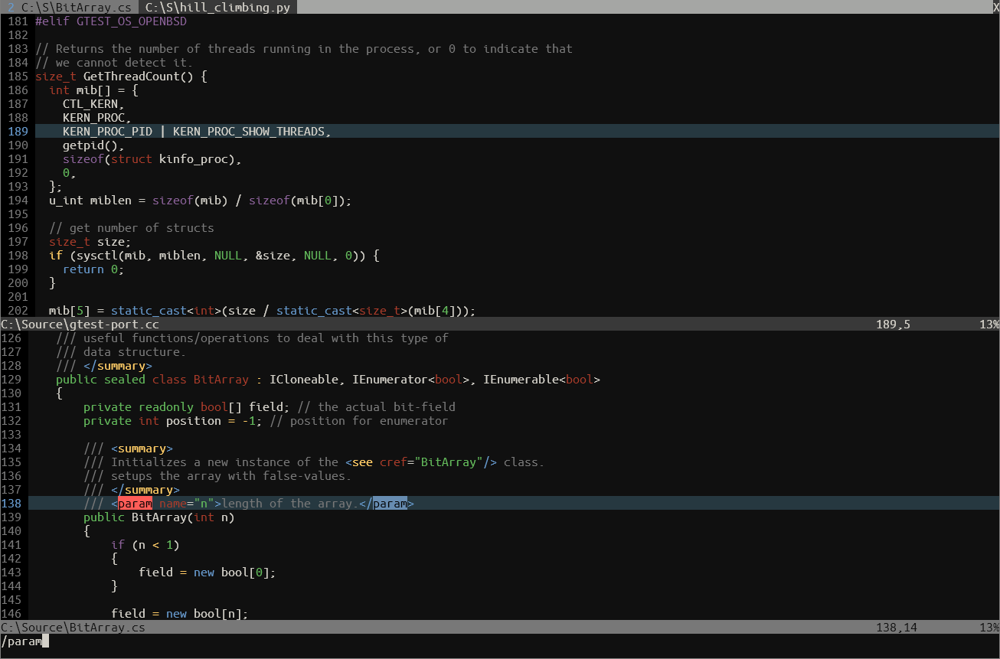

# Starry Night
A dark Vim/Neovim color scheme with rich colors on a deep black background.

Starry Night was inspired by the [base16-eighties.vim](https://github.com/chriskempson/base16-vim "base16-eighties.vim") color scheme and it was created with the [Colortemplate](https://github.com/lifepillar/vim-colortemplate "Colortemplate") plugin.

This color scheme is mostly intended to be used on a GUI. Terminal colors are supported but they were not thoroughly tested and they are simply my best attempt to set the closest matching color available. Constructive feedback is welcome.

### Preview


### Installation
You can use any of the conventional methods to install a colorscheme. To install with vim-plug add the following line to the vim-plug section of your configuration file:
```
Plug 'josegamez82/starrynight'
```

### Enabling Starry Night
To enable Starry Night enter the following command into Vim/Neovim:
```
:colorscheme starrynight
```
Or add the following to your configuration file:
```
colorscheme starrynight
```
